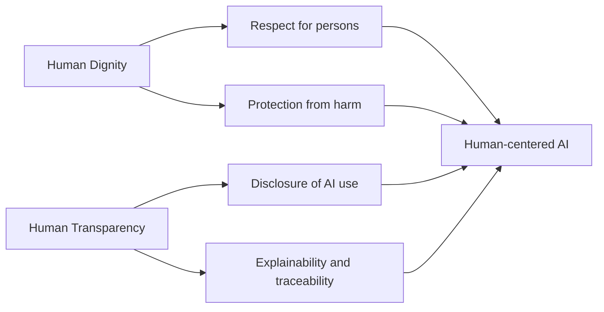
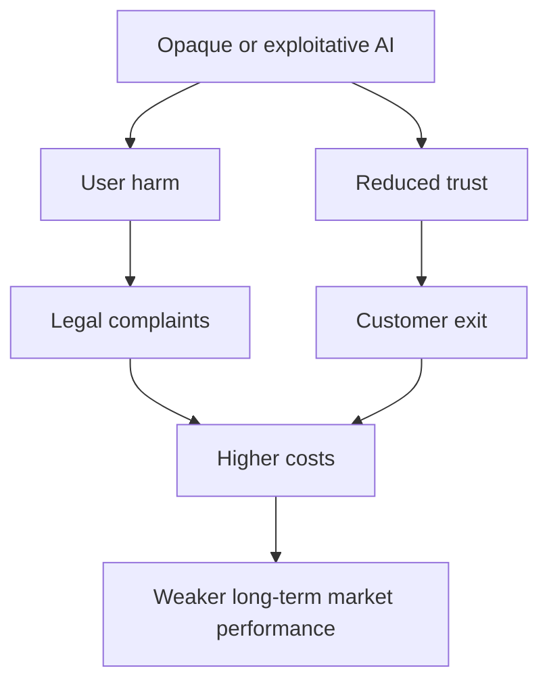
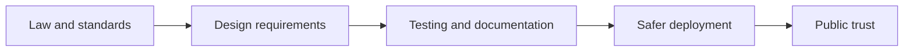
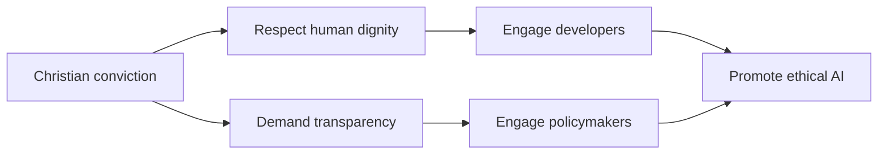

# Human Dignity and Transparency and Explainability in AI

This presentation discusses the **Value of Human Dignity** and the **Principle of Transparency and Explainability** from UNESCO's *Recommendation on the Ethics of Artificial Intelligence*.

---

## 1) Key Points and Examples

| Topic | Key idea | Why it matters | Example |
| --- | --- | --- | --- |
| **Human Dignity** | Every person has inherent worth and must never be treated as a mere data point, product, or obstacle. | AI should serve people, protect rights, and avoid degrading or exploitative treatment. | A hiring system should not reduce applicants to opaque scores that ignore their humanity and context. |
| **Human Transparency** | People should understand when AI is being used, what it is doing, and how its outputs affect them. | Transparency builds trust, supports accountability, and enables meaningful human oversight. | A bank using AI for loan screening should clearly disclose that automated tools are involved and explain the main decision factors. |

### Summary

- **Human dignity** requires AI systems to respect human worth, agency, privacy, and fairness.
- **Human transparency** requires disclosure, explainability, traceability, and honest communication about AI capabilities and limits.
- Together, they push developers to design systems that are **human-centered**, not merely efficient or profitable.

### Visual: Relationship Between the Value and Principle

### Practical Examples

1. **Healthcare triage AI**
   - Dignity means patients should not be denied care by an unchallengeable model.
   - Transparency means patients and clinicians should know when AI recommendations are being used.
2. **Facial recognition**
   - Dignity is violated when people are surveilled constantly without consent.
   - Transparency is violated when people do not know biometric systems are identifying or tracking them.
3. **Generative AI in education**
   - Dignity supports student development rather than manipulation or replacement.
   - Transparency requires clear labeling of AI-generated feedback, tutoring, or grading support.

---

## 2) Negative Actions and Free-Market Ramifications

### Actions That Violate Human Dignity and Transparency and Explainability

| Negative action | Value/principle violated | Likely harm | Free-market ramifications |
| --- | --- | --- | --- |
| Secretly collecting user data to train models | Dignity and transparency | Loss of privacy, exploitation, erosion of consent | Consumers lose trust, firms face churn, and markets punish deceptive brands over time. |
| Using black-box hiring or lending tools without explanation | Transparency | People cannot challenge unfair outcomes | Information asymmetry distorts market choice and can invite lawsuits, compliance costs, and reputational damage. |
| Manipulative recommender systems designed to maximize addiction | Dignity | People are treated as attention targets rather than moral agents | Short-term profit may rise, but long-term social backlash can trigger regulation and reduce brand value. |
| Bias against vulnerable groups in policing, insurance, or employment tools | Dignity | Exclusion, stigma, and unequal treatment | Unfair competition emerges when firms externalize harm onto society rather than bearing ethical costs. |
| Overstating AI accuracy or hiding limitations in marketing | Transparency | Unsafe overreliance by customers | Markets function poorly when buyers cannot evaluate product quality honestly. |

### Free-Market Reflection

From a free-market perspective, ethical failures in AI create **distorted incentives**:

- Companies may seek profit by hiding risks rather than improving products.
- Customers cannot make informed choices when transparency is absent.
- Harmed individuals often bear costs that are not reflected in the price of the technology.
- Trust, which is essential for healthy markets, declines when firms treat people as exploitable inputs.

In other words, violating dignity and transparency may produce **short-term gains** but weakens the long-term conditions that make free exchange legitimate and sustainable.

### Visual: How Unethical AI Harms Markets

---

## 3) Relevant Legislation, Regulations, and Standards

| Framework | Type | Relevance to dignity and transparency | Impact on AI development and deployment |
| --- | --- | --- | --- |
| **UNESCO Recommendation on the Ethics of AI** | Global ethical framework | Centers human rights, dignity, accountability, and transparency | Encourages organizations to build governance, impact assessment, and human oversight into AI lifecycles. |
| **EU AI Act** | Legislation/regulation | Imposes obligations for high-risk AI, including documentation, transparency, and risk controls | Pushes developers to classify use cases, document systems, test risk, and maintain oversight before deployment. |
| **GDPR** | Data protection regulation | Protects privacy, consent, and rights related to automated decision-making | Requires data minimization, lawful processing, and clearer justification for AI systems using personal data. |
| **NIST AI Risk Management Framework (AI RMF)** | Standard/guidance | Promotes trustworthy, explainable, and accountable AI | Shapes internal controls, risk reviews, and communication practices even where not legally mandatory. |
| **ISO/IEC 42001** | Management system standard | Supports governance and responsible AI operations | Encourages organizations to formalize policies, roles, audits, and continuous improvement for AI systems. |
| **IEEE 7001** | Technical standard | Focuses on transparency in autonomous and intelligent systems | Helps teams define what transparency means for users, auditors, and impacted communities. |

### Why These Frameworks Matter

These legal and ethical frameworks influence AI work by requiring or encouraging teams to:

- document model purpose, training data, and limitations;
- disclose when AI is used;
- assess risks before release;
- keep humans responsible for high-impact decisions; and
- provide mechanisms for review, appeal, and correction.

### Visual: Frameworks Shaping AI Deployment

---

## 4) Christian Engagement and Advocacy

Christians can contribute to AI conversations by grounding their engagement in the belief that every human being bears the **image of God** and therefore deserves respect, truthfulness, and protection from exploitation.

### Practical Ways to Engage

1. **Speak in terms developers understand**
   - Connect dignity to user safety, fairness, and human-centered design.
   - Connect transparency to explainability, disclosure, and accountability.
2. **Advocate for the vulnerable**
   - Raise concerns about systems that disproportionately harm the poor, disabled, elderly, migrants, or minorities.
3. **Encourage truthful communication**
   - Challenge exaggerated claims about AI capabilities.
   - Support honest labeling of AI-generated content and automated decisions.
4. **Participate in public policy**
   - Submit public comments, attend community forums, and support legislation that protects people from abusive AI uses.
5. **Model constructive dialogue**
   - Ask questions, listen carefully, and seek common ground with engineers, business leaders, and policymakers.

### Christian Values That Align With Ethical AI

| Christian value | Application to AI ethics |
| --- | --- |
| Love of neighbor | Design and deploy AI in ways that protect people rather than exploit them. |
| Truthfulness | Disclose AI use and communicate limits honestly. |
| Justice | Prevent biased systems from harming vulnerable communities. |
| Stewardship | Use innovation responsibly and with accountability. |
| Human worth | Reject systems that reduce people to profit signals or manipulable behavior. |

### Visual: Christian Advocacy Path

---

## Conclusion

Human dignity reminds us that **people are the purpose of technology, not the raw material for it**. Human transparency ensures that AI systems remain open enough to be questioned, governed, and trusted. When developers, lawmakers, and communities protect both, AI is more likely to contribute to justice, trust, and genuine human flourishing.
